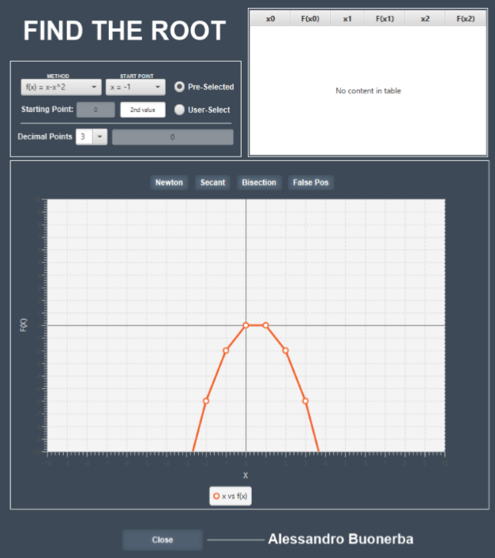

<!-- PROJECT SHIELDS -->
<!--
*** I'm using markdown "reference style" links for readability.
*** Reference links are enclosed in brackets [ ] instead of parentheses ( ).
*** See the bottom of this document for the declaration of the reference variables
*** for contributors-url, forks-url, etc. This is an optional, concise syntax you may use.
*** https://www.markdownguide.org/basic-syntax/#reference-style-links
-->
[![Contributors][contributors-shield]][contributors-url]
[![Forks][forks-shield]][forks-url]
[![Stargazers][stars-shield]][stars-url]
[![Issues][issues-shield]][issues-url]
[![MIT License][license-shield]][license-url]
[![LinkedIn][linkedin-shield]][linkedin-url]

<!-- PROJECT LOGO -->
 

  

  <h3 align="center">Root Function</h3>

  

    An application realised for an university project.
     
    <a href="https://github.com/Dieman89/RootFunction"><strong>Explore the docs »</strong></a>
     
     
    <a href="https://github.com/Dieman89/RootFunction">View Demo</a>
    ·
    <a href="https://github.com/Dieman89/RootFunction/issues">Report Bug</a>
    ·
    <a href="https://github.com/Dieman89/RootFunction/issues">Request Feature</a>
  

<!-- ABOUT THE PROJECT -->
## About The Project

    

A Java application to find the roots of a Function f(x) using Numerical Methods and Data Structures.

Finding the roots of a function is a very important technique used in many applications. For example, these applications can range from engineering, chemistry, business, and economics– there are others. What appears graphically as a rather straightforward identification of the roots  (i.e.  where  the  function/curve  crosses  the  x-axis)  is  not  so  readily  achieved  when  requiring to determine the numerical value to a given precision.The use of numerical methods such as functional iteration, Newton-Raphson, Secant and the Bisection   methods   can   determine   these   roots,   but   each   method   has   advantages,   disadvantages and limitations, and these must be clearly understood in order to successfully use these in solving real problems.

## Numerical Methods

The Numerical Methods that are implemented in this Software are:

* Newton-Raphson
* Secant
* Bisection
* Regula Falsi

## Data Structures

The Data Structures used are:

* Array
* Linked List

## Functionalities

* Selection of a function f(x) being solved based from a list
* Plotting the function in a suitable range to show the root(s) of the equation
* Selection of one or more of the root-finding methods
* User selection of the starting point(s) for the numerical algorithm to find the root
* Display of the root found to a user-selected number of decimal places for the selected numerical method
* Tabular and graphical representation of results to show iterative history of calculation breakdown and root approximations

### Built With

* [IntelliJ Idea](https://www.jetbrains.com/idea/)
* [Java](https://www.java.com/)

## License

Distributed under the MIT License. See `LICENSE` for more information.

## Contact

Alessandro Buonerba [@Dieman_](https://twitter.com/Dieman_) - a.buonerba@hotmail.com

Project Link: [https://github.com/Dieman89/RootFunction](https://github.com/Dieman89/RootFunction)

<!-- MARKDOWN LINKS & IMAGES -->
<!-- https://www.markdownguide.org/basic-syntax/#reference-style-links -->
[contributors-shield]: https://img.shields.io/github/contributors/othneildrew/Best-README-Template.svg?style=flat-square
[contributors-url]: https://github.com/Dieman89/RootFunction/graphs/contributors
[forks-shield]: https://img.shields.io/github/forks/othneildrew/Best-README-Template.svg?style=flat-square
[forks-url]: https://github.com/Dieman89/RootFunction/network/members
[stars-shield]: https://img.shields.io/github/stars/othneildrew/Best-README-Template.svg?style=flat-square
[stars-url]: https://github.com/Dieman89/RootFunction/stargazers
[issues-shield]: https://img.shields.io/github/issues/othneildrew/Best-README-Template.svg?style=flat-square
[issues-url]: https://github.com/Dieman89/RootFunction/issues
[license-shield]: https://img.shields.io/github/license/othneildrew/Best-README-Template.svg?style=flat-square
[license-url]: https://github.com/Dieman89/RootFunction/blob/master/LICENSE.txt
[linkedin-shield]: https://img.shields.io/badge/-LinkedIn-black.svg?style=flat-square&logo=linkedin&colorB=555
[linkedin-url]: https://linkedin.com/in/buonerba
[screenshot]: images/screenshot.png